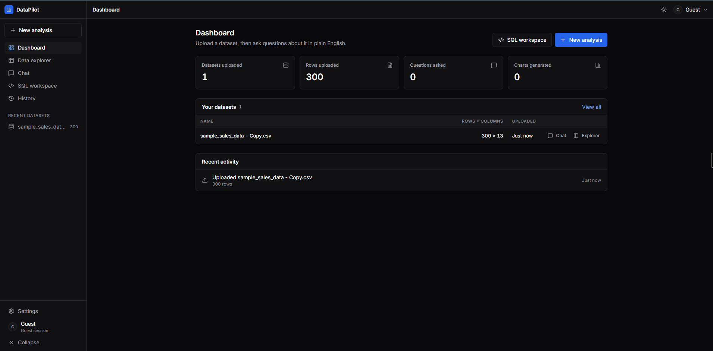
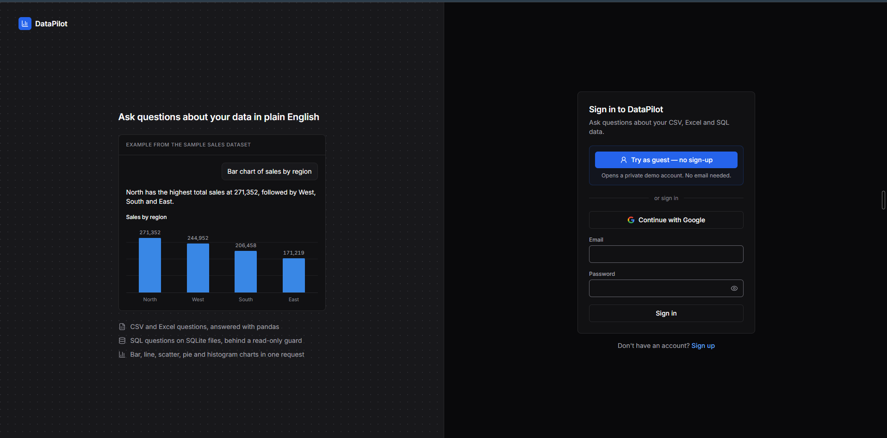
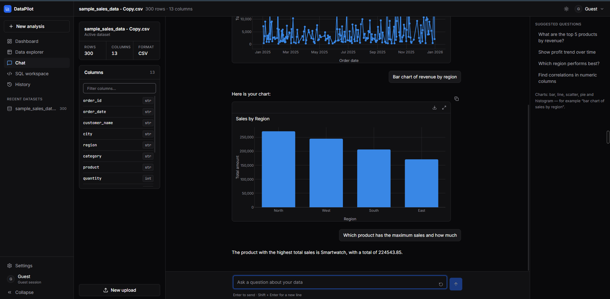
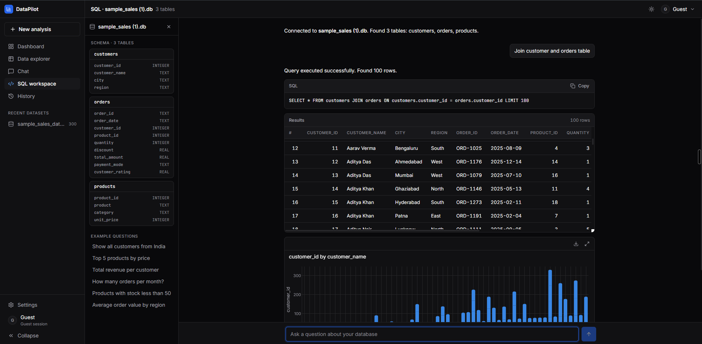
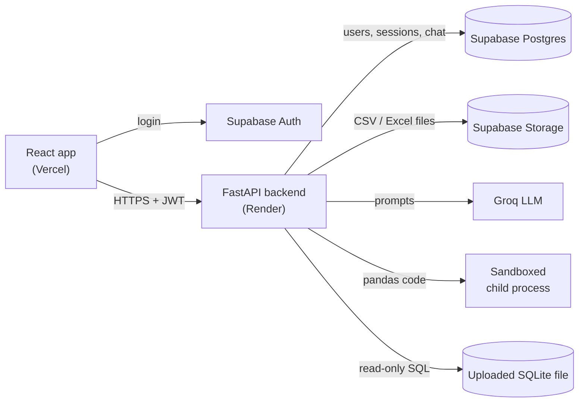

# DataPilot

Ask questions about a CSV, Excel or SQLite file in plain English, and get answers, tables and charts computed from the real data.

**Live demo: [datapilot-one.vercel.app](https://datapilot-one.vercel.app)** · Try as guest — no sign-up



The LLM never answers a numeric question from memory. It writes pandas or SQL, the backend runs that code on your data, and the numbers you see come from the result.

---

## Screenshots

| Login | Dashboard |
|---|---|
|  |  |
| **Chat with a chart** | **SQL workspace** |
|  |  |

---

## Features

- **Chat with a spreadsheet.** Upload a CSV, `.xlsx` or `.xls` file (up to 10 MB). You get a column summary (types, missing values, samples) and four generated insights. Questions are answered by pandas code that the LLM writes and the backend runs in a sandbox.
- **Charts.** Five types: bar, line, scatter, pie and histogram. Repeated categories are aggregated before plotting (sum, or mean when you ask for an average), bars are sorted largest first, and charts follow the light/dark theme.
- **SQL mode.** Upload a SQLite `.db` file and ask questions. The LLM writes SQL for that database's dialect, a guard allows only a single read-only query, and if the database rejects the query, the error goes back to the LLM to fix it (up to 2 corrections). The UI shows the generated SQL, each failed attempt, a results table and a chart.
- **Guest mode.** "Try as guest" creates a real, private anonymous account through Supabase, so each guest's data is isolated like any other user's. Email/password and Google sign-in are also available.
- **History.** Reopen a past dataset (the session ID is in the URL, so refresh and bookmarks work) and see earlier messages. Deleting a dataset removes the stored file first, then the database rows.
- **Dashboard.** Per-user stats (datasets, rows, questions asked, charts generated), your recent datasets and recent activity.

---

## How it works



The React frontend signs in with Supabase and sends the JWT with every request; the backend verifies it against Supabase's public keys (JWKS). For a file question, the backend loads the file from Supabase Storage and gives the LLM a description of the columns, not the data. The LLM replies in JSON with one action: `code` (pandas), `chart` (a chart spec) or `answer` (structure-only questions, never numbers). Code runs in an isolated process; the result is rounded and sorted in code, then a second LLM call explains it in a sentence. SQL questions follow the same idea: generate, check, run read-only, and self-correct on database errors.

---

## Engineering highlights

- **Two-layer sandbox for generated code** (`backend/agent/tools/python_exec.py`).
  1. A static check on the Python AST refuses imports, names starting with `_`, pandas file readers and writers, and any `pd.*` function outside an allow-list of 30. Only 24 safe built-ins exist (`open`, `eval` and `__import__` do not).
  2. The code then runs in a separate child process that clears its environment variables (no API keys or database URL), installs a Python audit hook (PEP 578) that blocks file writes, reads outside the Python installation, sockets and subprocesses, and is killed after 10 seconds.
- **SQL guard** (`check_query` in `backend/services/sql_service.py`). It blanks out strings and comments, then allows exactly one statement starting with `SELECT` or `WITH`. It rejects write keywords anywhere (including `INTO`), risky server functions (`pg_read_file`, `load_extension`, `xp_cmdshell`, …) and quoting tricks where databases disagree on where a string ends. In offline tests it blocks 21 of 21 attack queries and accepts 18 of 18 valid ones. Uploaded SQLite files are also opened read-only (`mode=ro&immutable=1`), so a query that got past the guard still couldn't write.
- **SQL self-correction** (`backend/agent/tools/sql_tool.py`). The database's own error message goes back to the LLM, at most 2 times. Guard rejections are final and never retried, since a retry would answer a different question.
- **Known-answer eval** (`backend/evals/agent_known_answers.py`). 13 questions with answers computed by pandas, on test data built with traps: the product with the most units, the most revenue and the largest single order are three different products, so each wrong method gives a different wrong answer.
- **Model as configuration.** The Groq model is set by the `GROQ_MODEL` environment variable (default `openai/gpt-oss-20b`), and every LLM call goes through one wrapper (`backend/services/llm.py`) with JSON mode, retries and clean user-facing errors. When Groq retires a model, the fix is a config change, not a code change.
- **Health check with a real database query.** `GET`/`HEAD /health` runs `SELECT 1` on Postgres with a 5-second timeout and returns 200, or 503 if the database is unreachable.

---

## Tech stack

| Layer | Technology |
|---|---|
| Frontend | React 19, Vite, React Router, Tailwind CSS, Plotly.js, Supabase JS |
| Backend | Python 3.11, FastAPI, SQLAlchemy (async + asyncpg), pandas, Plotly |
| LLM | Groq (`openai/gpt-oss-20b` by default), called through `langchain-groq` |
| Data and auth | Supabase Postgres, Supabase Auth (JWT, anonymous sign-in), Supabase Storage |
| Hosting | Vercel (frontend), Render (backend), UptimeRobot (monitoring) |

---

## Run locally

Requirements: Python 3.11, Node.js, a Supabase project and a Groq API key.

**Backend**

```bash
cd backend
python -m venv venv
source venv/bin/activate        # Windows: venv\Scripts\activate
pip install -r requirements.txt
cp .env.example .env            # then fill in the values
uvicorn main:app --reload --port 8000
```

| Variable | Purpose |
|---|---|
| `GROQ_API_KEY` | Groq API key (secret). |
| `GROQ_MODEL` | Groq model ID. Default `openai/gpt-oss-20b`. |
| `GROQ_REASONING_EFFORT` | `low` by default. Set it empty for a non-reasoning model. |
| `DATABASE_URL` | Postgres connection string (secret). If unset, a local SQLite file is used. |
| `SUPABASE_URL` | Supabase project URL. Used for JWT verification (JWKS) and Storage. |
| `SUPABASE_SERVICE_KEY` | Supabase service-role key for Storage (secret, server only). |
| `SUPABASE_BUCKET` | Storage bucket name. Default `datapilot-uploads`. |

API docs are at `http://localhost:8000/docs`.

**Frontend**

```bash
cd frontend
npm install
cp .env.example .env            # then fill in the values
npm run dev                     # http://localhost:5173
```

| Variable | Purpose |
|---|---|
| `VITE_SUPABASE_URL` | Supabase project URL. |
| `VITE_SUPABASE_ANON_KEY` | Supabase anon (public) key. |
| `VITE_API_URL` | Backend URL, ending in `/api`, e.g. `http://localhost:8000/api`. |

Set `VITE_API_URL` explicitly: if it is missing, the frontend falls back to the deployed backend, and every question you ask uses the live Groq quota.

---

## Deploy

- **Supabase** (one project for database, auth and storage)
  - Copy the Postgres connection string into `DATABASE_URL`. The backend creates its tables on startup.
  - Create a Storage bucket named after `SUPABASE_BUCKET` (default `datapilot-uploads`).
  - Authentication → Sign In / Providers: turn on **Allow anonymous sign-ins** (needed for guest mode). Enable Google if you want Google sign-in.
  - Guest users have no email. If your `users` table was created before guest mode existed, make the column nullable once in the SQL editor:
    ```sql
    ALTER TABLE users ALTER COLUMN email DROP NOT NULL;
    ```
- **Render** (backend): root directory `backend`, build `pip install -r requirements.txt`, start command from `backend/Procfile` (`uvicorn main:app --host 0.0.0.0 --port $PORT`). Add the backend variables above in the dashboard. Changing `GROQ_MODEL` there restarts the service with no code change.
- **Vercel** (frontend): root directory `frontend`, framework Vite. Add the three `VITE_*` variables. `frontend/vercel.json` rewrites all paths to `index.html` so client-side routes work on refresh.
- **UptimeRobot**: an HTTP(s) monitor on `https://<your-backend>/health` every 5 minutes. Because `/health` runs a real database query, the same ping keeps Render's free instance awake, keeps the Supabase project active, and alerts on outages.
- **Forks:** the CORS allow-list and the backend URL used by the keep-alive ping are hard-coded in `backend/main.py`; update them for your own domains.

---

## Testing

Tests run offline by default. Groq's free tier is a daily token quota shared with the live site, so tests replace `ask_llm` (`backend/services/llm.py`) with a scripted fake that returns pre-written replies, and use a local SQLite database. This keeps them free and deterministic, and covers agent routing, chart specs, SQL self-correction and the SQL guard.

```python
import json
import agent.core as core

replies = [
    {"action": "code", "params": "result = df.groupby('region')['total_amount'].sum()"},
    {"answer": "North is highest at 271,352.05."},
]
core.ask_llm = lambda llm, messages: json.dumps(replies.pop(0))
agent = core.create_agent(df, "test")
print(agent.invoke({"input": "Total sales by region?"})["output"])
```

On Windows the sandbox starts a fresh Python process, so put test scripts under `if __name__ == "__main__":`.

**Known-answer eval.** This one makes real Groq calls.

```bash
cd backend
python -m evals.agent_known_answers   # exits 1 if any case fails
```

> **Warning:** one run uses about 55k tokens, roughly a quarter of Groq's free daily quota, and that quota is shared with anything else using the same key (including a deployed site). Run it only after prompt or model changes.

Frontend: `npm run lint` and `npm run build` in `frontend/`.

---

## Known limitations

- **Live database connections don't work on the deployed site.** The SQL page has a MySQL / PostgreSQL / SQL Server connection form, but the drivers aren't installed on Render. Uploading a SQLite `.db` file is the supported path.
- **No conversation memory.** Each question is answered on its own; earlier messages are shown but not sent to the model, so follow-ups like "and for the North?" lack context.
- **Insights aren't stored.** They're generated once at upload, so a dataset reopened from History shows none. Charts aren't stored either; old chart replies ask you to ask again.
- Uploaded `.db` files and SQL sessions live on the backend's local disk and in memory, so they're lost when Render restarts.
- There is no per-user rate limit. If the shared Groq quota runs out, the app says the AI service is busy until it resets.

---

## Author

Sourabh Saxena · [GitHub](https://github.com/sourabh-550) · [LinkedIn](https://www.linkedin.com/in/sourabh55)
